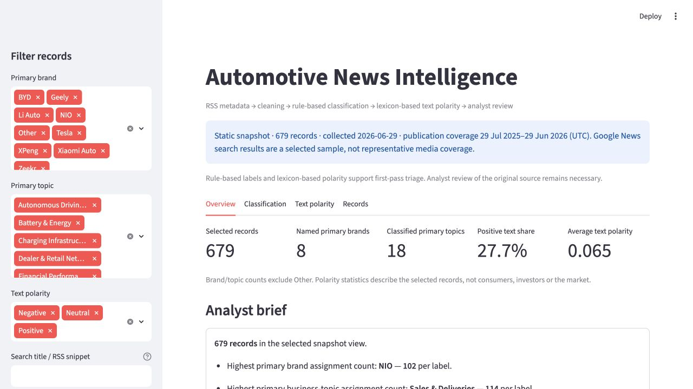
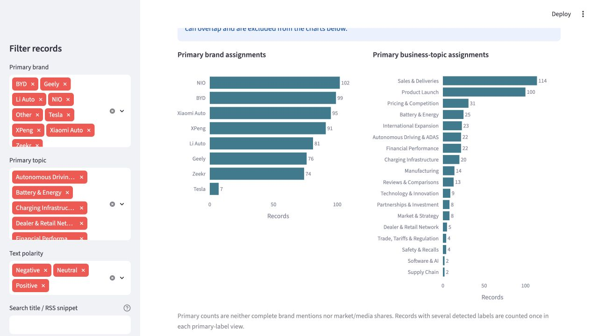
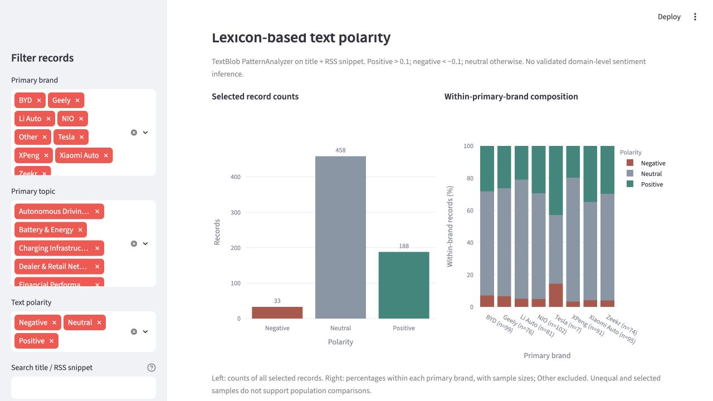
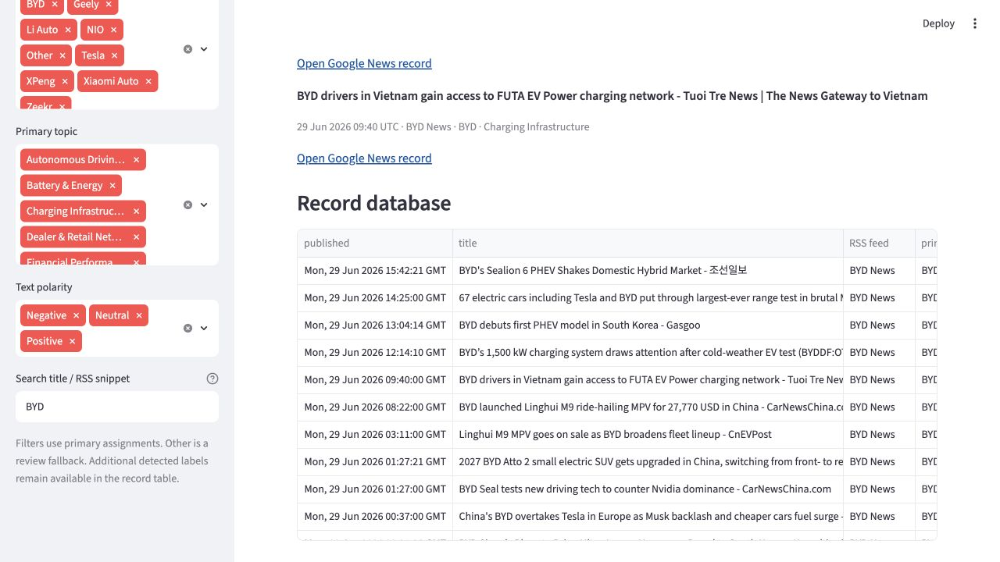

# Automotive News Intelligence Workflow

A reproducible Python workflow for collecting, cleaning, classifying and exploring automotive RSS news metadata.

Built for **market-intelligence analysts and automotive researchers performing first-pass news triage**. The project demonstrates metadata ingestion, text-quality checks, transparent keyword classification and an interactive analyst interface.



## Business Question

**Which collected automotive news records mention the brands and topics being monitored, and which records warrant further analyst review?**

The workflow organizes information and makes records easier to inspect. The analyst decides what warrants review; the application does not rank business importance or produce investment, market-entry or causal recommendations.

## What the Workflow Does

```text
Google News RSS
    → Raw Snapshot
    → Cleaning & Deduplication
    → Rule-Based Brand/Topic Classification
    → Lexicon-Based Sentiment Annotation
    → Streamlit Analyst Interface
```

Each processing step is an explicit batch command. Opening the app reads the saved enriched snapshot; it does not collect news or refresh the pipeline.

## Dataset Snapshot

| Measure | Bundled snapshot |
|---|---:|
| Raw RSS records | 700 |
| Cleaned / classified / enriched records | 679 / 679 / 679 |
| Search feeds | 7, with 100 raw results each |
| Publication coverage (UTC) | 29 July 2025–29 June 2026 |
| Collection date | 29 June 2026; original timezone was not recorded |
| Named primary brands represented | 8 |
| Classified primary business topics | 18 |
| Primary brand fallback (`Other`) | 54 |
| Primary topic fallback (`Other`) | 253 |
| Text polarity: positive / neutral / negative | 188 / 458 / 33 |

These are counts within a selected snapshot, not market or media shares. [Data provenance, fields and complete distributions](data/README.md).

## Methodology

### Collection

Seven Google News RSS searches target BYD, Geely, Zeekr, NIO, XPeng, Li Auto and Xiaomi. Tesla is an additional classification label, not a dedicated collection feed. RSS queries request English-language US results; language is not independently validated.

The bundled raw file is preserved. `source` identifies the **query/feed**, not the publisher. All historical article links are Google News redirects. Publisher names may appear in the supplied text but were not captured in a separate historical field.

The optional collector uses normal TLS verification, UTC collection timestamps and explicit RSS publisher metadata where supplied. It refuses to save a partially failed collection and protects the bundled raw path. No full article bodies are fetched.

### Cleaning

Strict UTF-8 decoding, HTML-tag removal, HTML-entity decoding and whitespace normalization preserve punctuation and non-English source names. Missing text becomes an empty string. Required fields are validated; malformed CSV is not silently skipped.

The bundled run removes **19 duplicate URLs** and **2 records without a broad automotive keyword**, leaving **679 records**. The broad relevance filter uses substring matches and is not a trained relevance model. Duplicate URLs retain their first occurrence, so a record found by several queries keeps the first feed attribution. One repeated title remains under different Google News URLs; titles alone do not establish identical articles.

### Rule-Based Classification

The existing automotive keyword dictionaries assign labels to **title + cleaned RSS snippet**:

- Single-word keywords use word boundaries; phrases use substring counts.
- A label's score is its **keyword-match count**, not confidence or probability. Counts can exceed one. Overlapping keywords and text repeated between title and snippet can increase counts.
- `primary_brand` and `primary_topic` take the highest count. Ties deterministically use the first label in the source dictionary. This is a convention, not evidence that the first label is more important.
- `brand` and `topic` preserve all detected labels as **JSON arrays**, including labels with commas. `[]` means none detected.
- `Other` is a fallback for analyst review, not a brand or business topic.

The snapshot contains **70 records with multiple detected brands** and **105 with multiple topics**; **65 brand** and **82 topic** decisions have a tied highest count. There is no manually labelled ground truth, so classification accuracy is not claimed.

Primary counts are not complete mention counts. For example, Tesla appears in the detected labels of **40 records**, but is the primary brand in **7**. Brand/group relationships and synonyms beyond the declared dictionary are not inferred.

### Sentiment

TextBlob's **PatternAnalyzer** supplies lexicon-based text polarity on title + snippet. There is no model training, API call or external inference service.

- Positive: polarity `> 0.1`
- Negative: polarity `< -0.1`
- Neutral: otherwise

The mean is **0.065** and positive text-polarity share is **27.7%** of the 679 records. These annotations describe wording, not validated consumer, investor or market sentiment. Short snippets, duplicated wording, missing context and language differences limit interpretation.

### Analyst Interface

Primary-brand, primary-topic and polarity filters combine with literal, case-insensitive search of titles and snippets. Additional detected labels are visible in the record table. The interface contains:

- **Overview:** snapshot scope, five data-derived KPIs and a deterministic analyst brief.
- **Classification:** primary-label counts; `Other` review counts are reported separately.
- **Text polarity:** record counts and within-primary-brand percentages with denominators.
- **Records:** chronologically sorted headlines, additional labels and Google News links.

Named-brand/topic KPIs exclude `Other`. Empty selections show `N/A` for percentages and means. The brief is a statistical template, not article summarization. There is no semantic search, importance ranking or automatic recommendation.

## Dashboard

### Primary classification



### Text polarity



### Record review



Screenshots show the regenerated bundled snapshot. The record-review screenshot uses a BYD text search; its selection is visible.

## Verified Observations

| Observation from this snapshot | Use for analyst triage | Limitation |
|---|---|---|
| 253 records have no primary business-topic match. | Review unmatched records before treating the taxonomy as comprehensive. | `Other` does not mean irrelevant; keyword coverage is incomplete. |
| NIO has 102 primary brand assignments, the highest named count. | Provides a starting subset for record inspection. | Query-based sampling and tie rules prevent claims about overall media attention. |
| Sales & Deliveries has 114 primary assignments, the largest named topic. | Find records mentioning commercial-volume developments. | Sales, registrations and deliveries are grouped, not harmonized numerical measures. |
| Tesla has 40 detected mentions but 7 primary assignments. | Inspect additional labels when researching multi-brand records. | Primary-only filtering does not return every detected mention. |
| The latest stored publication time is 29 June 2026, 16:01 UTC. | Start chronological review with the newest stored record. | This is a static snapshot, not current news monitoring. |

## Reproducibility

Tested with **Python 3.14.4** and the direct dependency versions pinned in `requirements.txt`. Tests use standard-library `unittest` and Streamlit AppTest; no separate test dependency is needed. Transitive dependencies are resolved by pip rather than a cross-platform lockfile.

From the repository root (the local folder may still have its original name):

```bash
python3 -m venv .venv
source .venv/bin/activate
python -m pip install -r requirements.txt

python -B src/processing/clean_articles.py
python -B src/analysis/classify_articles.py
python -B src/analysis/sentiment_analysis.py

python -m streamlit run src/dashboard/app.py
```

Run tests from the repository root:

```bash
python -B -m unittest discover -s tests -v
```

Input/output paths are derived from the script locations, not the current working directory. No API key or network connection is required for offline processing or the analyst interface once dependencies are installed.

For a deterministic rebuild check, hash `data/processed/*.csv`, rerun the three processing commands, and compare the hashes. The repair QC verified two complete offline runs with byte-identical outputs, execution from a different working directory, and a fresh virtual-environment installation with the same resulting artifacts. All 14 regression tests and `pip check` passed.

**Optional live collection — not needed to reproduce this portfolio snapshot:**

```bash
python -B src/collectors/news_collector.py
```

This makes network requests and writes a separate ignored file at `data/raw/live/automotive_news.csv`. A later replacement of that live file requires `--overwrite`. The bundled `data/raw/automotive_news.csv` is protected even with that flag. Live collection does not automatically replace the bundled processed artifacts or update the interface. New feeds and collection times are not deterministic.

## Repository Structure

```text
README.md
requirements.txt
.gitignore
data/
  README.md
  raw/automotive_news.csv
  processed/
    cleaned_automotive_news.csv
    classified_automotive_news.csv
    enriched_automotive_news.csv
src/
  collectors/news_collector.py
  processing/clean_articles.py
  analysis/
    classify_articles.py
    sentiment_analysis.py
    executive_summary.py
  dashboard/app.py
screenshots/
  dashboard_overview.png
  dashboard_classification.png
  dashboard_sentiment.png
  dashboard_records.png
tests/
  test_pipeline.py
  test_dashboard.py
```

## Limitations

- Query-based RSS sampling is not representative of all automotive news. Feed ordering, search results, deduplication and unequal publication ages shape the snapshot.
- Google News redirect links do not establish durable access to the original publication. Original publisher URLs and historical feed responses were not archived.
- RSS summaries are metadata/snippets, commonly repeating headlines, not full articles or generated abstracts. Source content may change or become unavailable.
- Keyword rules miss variants and context. Dictionary-order tie-breaking and repeated/overlapping keywords influence primary assignments; no classification ground truth or accuracy evaluation exists.
- Primary labels are not complete mention counts, market share or media share. Company-group relationships are not modelled; sales, registrations and deliveries share a broad triage topic.
- Lexicon text polarity is not validated automotive, consumer or investor sentiment.
- The original collection timezone is unknown; publication datetimes are interpreted in UTC. Historical publisher fields are absent.
- Metadata/snippets remain attributable to their sources. No reuse rights or complete provenance verification are claimed; see [data notes](data/README.md).
- This project does not use an LLM, RAG, embeddings, a learned ML classifier or an autonomous agent. It does not perform real-time monitoring, prediction, causal analysis or recommendations.

## AI Assistance

An AI coding assistant supported the repository audit and this portfolio refinement: identifying encoding and interpretation issues, helping implement targeted repairs, writing documentation and regression tests, and checking the regenerated artifacts and interface. This disclosure concerns development assistance, not an AI component in the runtime. No claim is made here about assistance during earlier project development.
